# About

Anggota Kelompok (Nama/NIM) :

1. Dhorifitto Diansyah P. / 2141720201
2. Josafat Pratama Susilo / 2141720031
3. Maidy Putri Joshi      / 2141720060
4. Nasyawa Ramadhia K.S.E / 2141720011
5. Novita Dwi Rahmadani   / 2141720050

Nama Aplikasi: TiketKu

Deskripsi Aplikasi:
Aplikasi TiketKu adalah sebuah aplikasi pemesanan tiket kereta api pihak ketiga berbasis mobile yang dibuat menggunakan bahasa pemrograman Dart dengan framework Flutter.

(tampilkan berupa gif jika app sudah selesai)

# Screen dan PIC

| No. | Nama Screen | Fitur | PIC
|-----|-------------|-------|-----|
| 1 | Splash Screen        | -     | Novita |
| 2 | Login Screen         | -     | Maidy |
| 3 | Register Screen      | -     | Maidy |
| 4 | Dashboard/Home Screen         | Carousel, TabView, BottomNavigationBar | Josafat |
| 5 | Jadwal Kereta | ListView horizontal untuk cari tanggal | Josafat |
| 6 | Detail Transaksi | - | Josafat |
| 7 | OCR KTP | Camera | Josafat |
| 8 | Dashboard Akun | - | Nasya |
| 9 | Tiket | - | Nasya |

dst

# Link Figma

[Link Figma](https://www.figma.com/file/9GjjCTbz8CVngw7S0I21sf/DHORIFFITO-DIANSYAH-PUTRA's-team-library?type=design&node-id=0%3A1&mode=design&t=cRNjatCPon3am4YQ-1)

# Fitur Unggulan

- Scan KTP dengan teknologi OCR yang dapat memudahkan pengguna dalam pengisian formulir data penumpang

# Credits

(jika ada aset image, icon, font, cantumkan di sini sumber URL)

# **Dokumentasi Screenshoot Tiketku:**
- User akan berada screen [SPLASHSCREEN] yang akan memunculkan logo dari Tiketku, seperti gambar berikut:

- User akan berada laman login pengguna [LOGIN] dimana user akan mengisikan alamat email dan password bagi yang sudah memiliki akun, seperti gambar berikut:

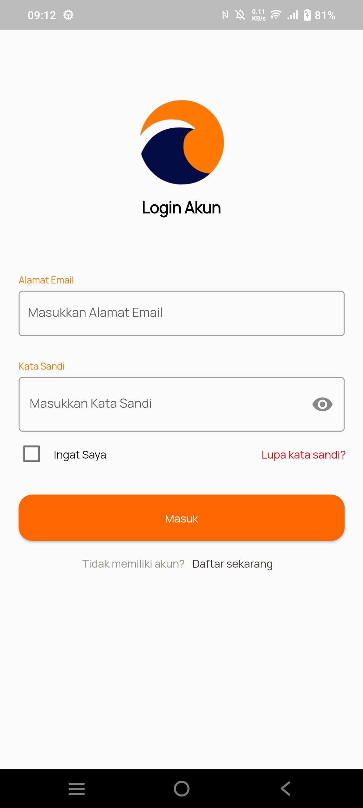

- Bagi user yang belum memiliki akun, maka dapat menekan text button 'Daftar sekarang' yang nantinya akan berganti ke laman register akun [REGISTER] dimana user akan mengisikan alamat email, nomor telepon dan password seperti gambar berikut:

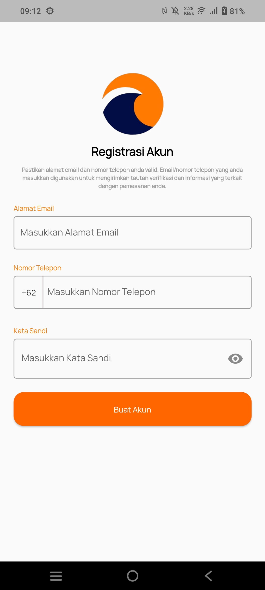

- User akan berada laman beranda pengguna setelah berhasil login [BERANDA/HOME] dimana user dapat memesan tiket kereta dengan pilihan KA Antar Kota dan KA Lokal, seperti gambar berikut:

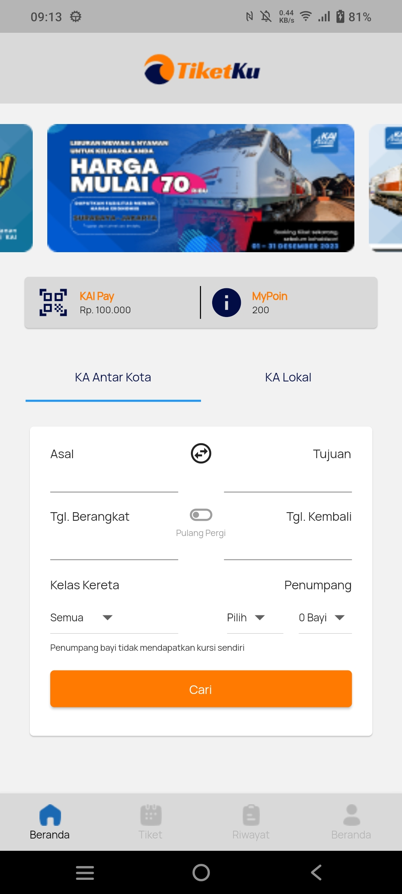

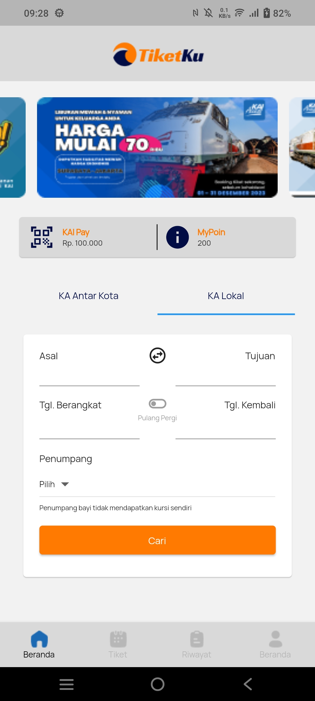

- User dapat memilih jadwal kereta yang sudah tersedia [JADWAL KERETA] dimana user dapat memilih kereta dengan jenis kereta, jam keberangkatan sampai jam tiba di tempat tujuan, seperti gambar berikut:

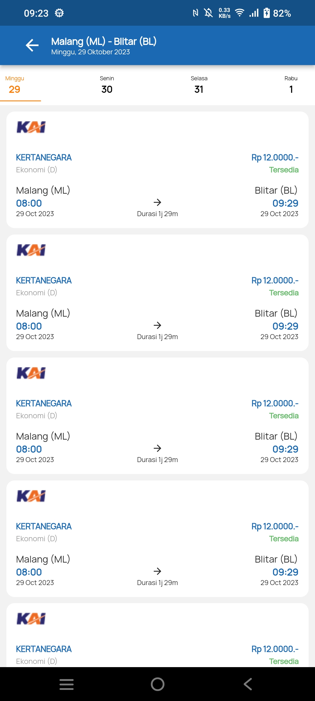

- User memasukkan data penumpang, dengan fitur unggulan kita yaitu OCR KTP [DETAIL TRANSAKSI] dimana user dapat menggunakan fitur scan guna mengisi otomatis dari data scan KTP, seperti gambar berikut:

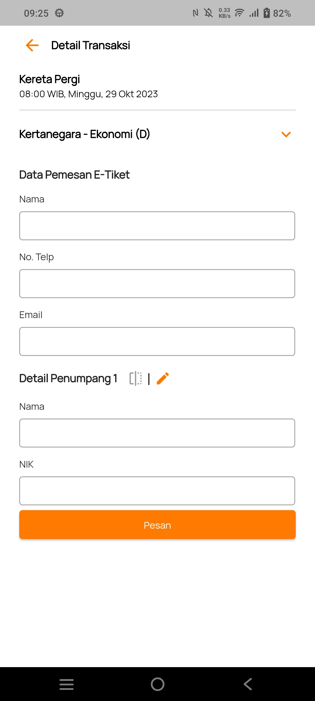

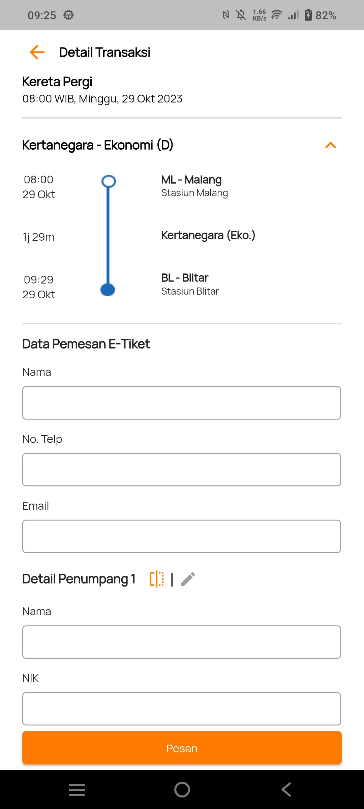

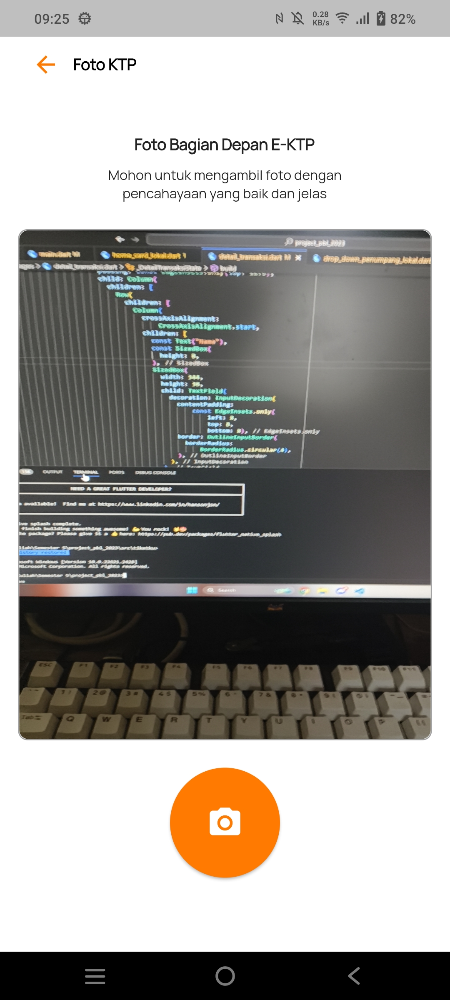

- Setelah itu, user dapat melihat detail pemesanan tiket dan dapat menggunakannya dengan 'cek tiket' pada kereta yang sudah dipesannya [TIKET] seperti gambar berikut:

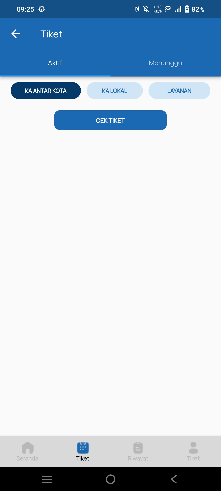

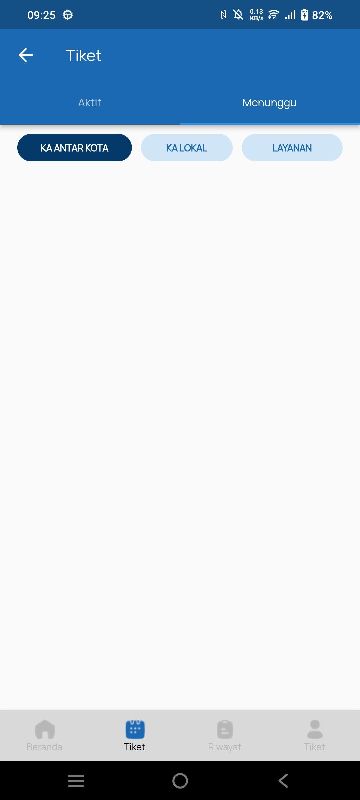

- User juga dapat melihat riwayat transaksi pembelian tiket dan layanan [RIWAYAT TRANSAKSI TIKET & LAYANAN], seperti gambar berikut:

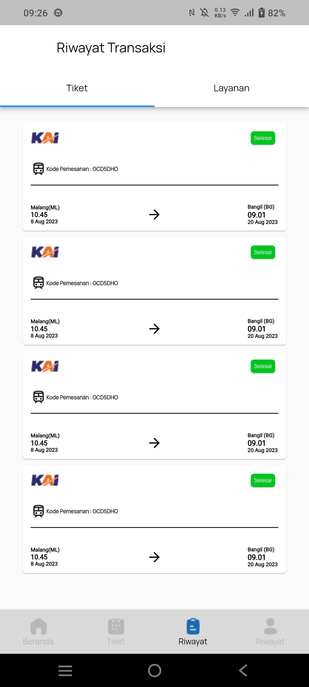

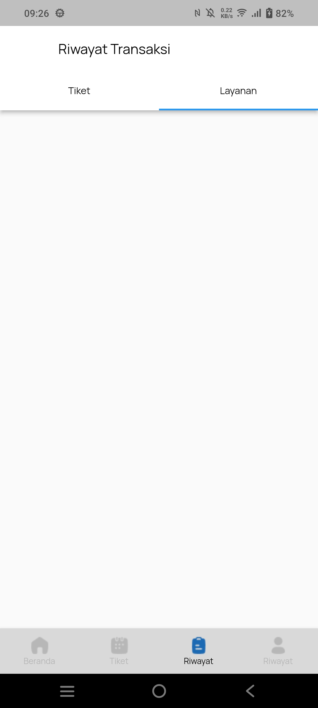

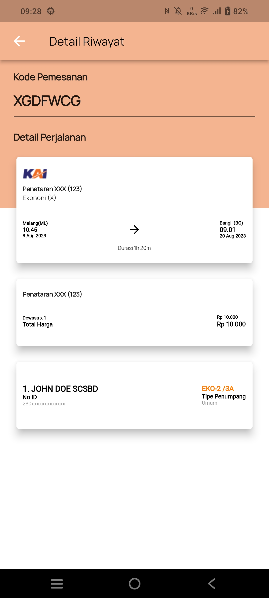

- User dapat mengubah dan melihat dashboard akun pengguna [DASHBOARD AKUN] dimana user dapat melihat detail akun, pusat bantuan dan tentang tiketku, seperti gambar berikut:

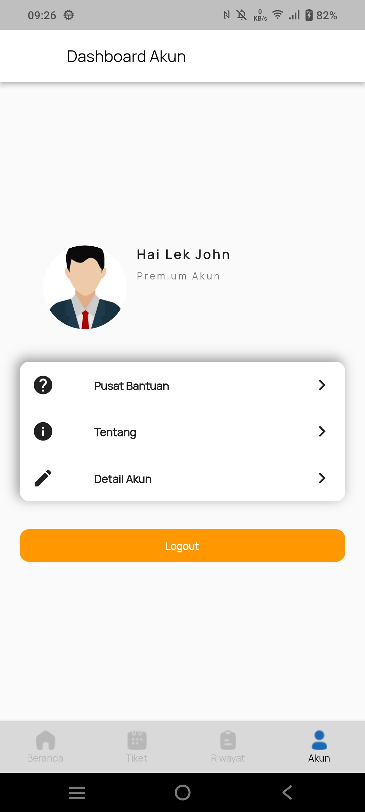

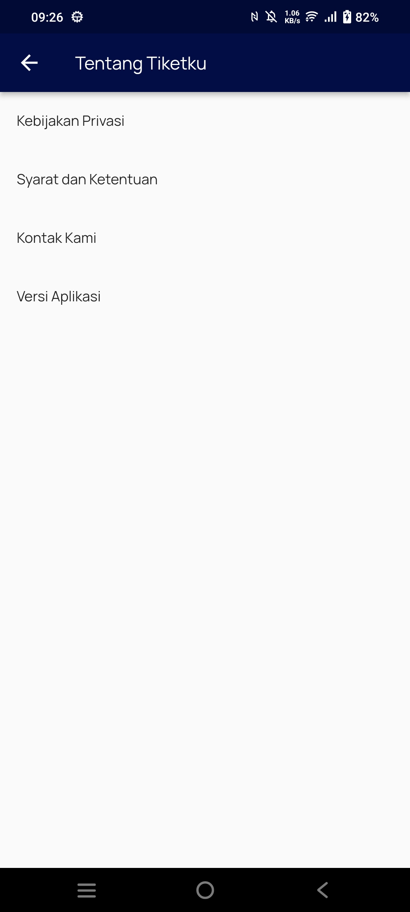

- Ketika user ingin logout darii akun tersebut maka ada button 'LOGOUT' [LOGOUT] dimana user akan kembali ke laman login akun, seperti gambar berikut:

